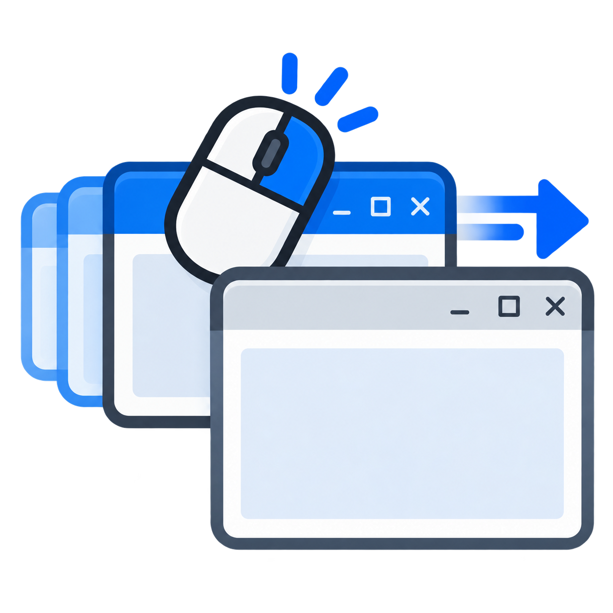

<p align="center"></p>

# RightDrag

Drag any window by its title bar with the **right** mouse button, and it moves without coming to the front.

The window stays exactly where it is in the stack. It doesn't take focus or rise above the others; it just slides to where you put it. That makes it easy to tidy a window you're only glancing at, or line up a reference window behind the one you're working in.

## Where the idea comes from

Acorn's RISC OS had this from the start. Its mouse had three buttons: *Select*, *Menu* and *Adjust*. Dragging a title bar with *Adjust* moved the window without raising it. I've missed it on every other desktop since, so this little tray app brings it to Windows.

## Using it

Download `RightDrag.exe` from the [latest release](https://github.com/deggle/right-drag/releases/latest) and run it. It sits in the notification area (system tray) and needs no installation.

- **Right-drag a title bar:** moves the window without activating it or changing its z-order.
- **Right-click a title bar without dragging:** works as normal, so the window menu and things like the browser tab-strip menu still appear.
- **Right-drag a maximised window:** restores it to normal size under the cursor, like a normal drag.
- **Tray menu:** turn it on or off (or double-click the icon), set **Start with Windows**, open **About** or exit.

It works with standard title bars and with apps that draw their own, such as Chrome, Edge, VS Code, Windows Terminal and File Explorer. It uses the same hit-test Windows uses to decide what's draggable.

### Limitations

- Windows' own Snap (edge snapping and snap layouts) only happens with a normal left-drag.
- Windows running as administrator can only be moved if RightDrag is also run as administrator.

## Building

It's a single C# file with no dependencies. It builds with the compiler that ships with Windows (.NET Framework 4.8), so you don't need Visual Studio or an SDK.

```
build.cmd
```

If an `app.ico` is present, `build.cmd` embeds it as the program icon.

GitHub Actions builds it on every push. To publish a release, update the version in `RightDrag.cs`, commit, then push a matching tag:

```
git tag v1.0.0
git push origin v1.0.0
```

## How it works

- A low-level mouse hook (`WH_MOUSE_LL`) watches for right-button presses.
- On each press it sends `WM_NCHITTEST` to the window under the cursor. It walks up through `HTTRANSPARENT` children just as Windows does, and if the answer is `HTCAPTION` it swallows the click, so the window never learns it was clicked and never activates.
- Moves are applied on a separate thread with `SetWindowPos(... SWP_NOACTIVATE | SWP_NOZORDER)`. Only the latest cursor position is kept, so a window that's slow to repaint jumps straight to the cursor instead of lagging behind.
- A right-click without movement is replayed with `SendInput`, so the normal context menus still work.

## Credits

Written by Tim Alston and Claude (Anthropic). Inspired by Acorn RISC OS.

## License

[MIT](LICENSE) © 2026 Tim Alston
